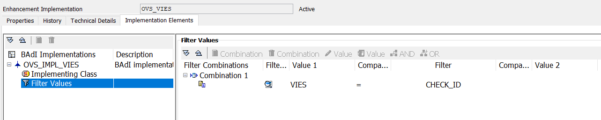

# Business Add-In implementation

Each validation must be located in a standalone BAdI implementation. 
&nbsp
Go to the transaction SE19, check 'New BAdI' in the Create implementation secion and provide OVS_ENH_CHECK as the name of the Enhancement spot. 
You will be prompted for the name of the Enhancement spot and the underlying BAdI, choose anything in customer namespace. 

## Implementation class
This Git repository contains an example class
```
ZCL_CHECKID_EXAMPLE
```
You can either 
- Checkout this GitHub repository or copy this class into your system. Then it can be used as the Implementation class during the BAdI creation. 
- Create a brand new implementation class. You can copy & paste desired code snippets from the example class to your implementation class. 

When the BAdI implementation is created, you have to provide a BAdI filter
```
CHECK_ID = <your_check_id>
```

Example
